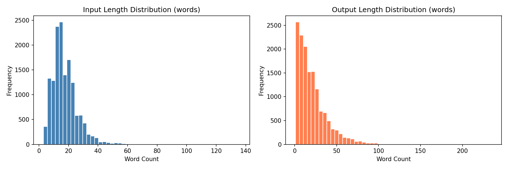
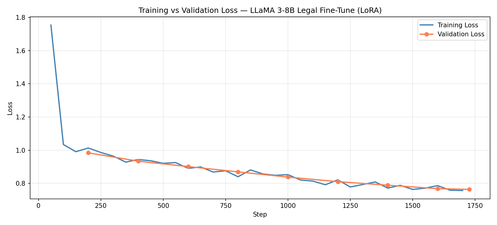
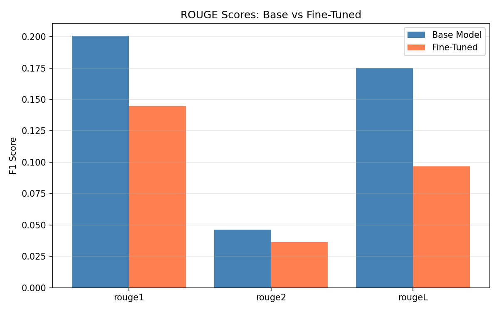
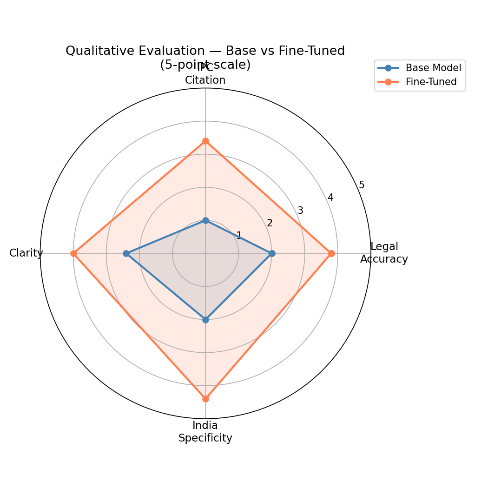
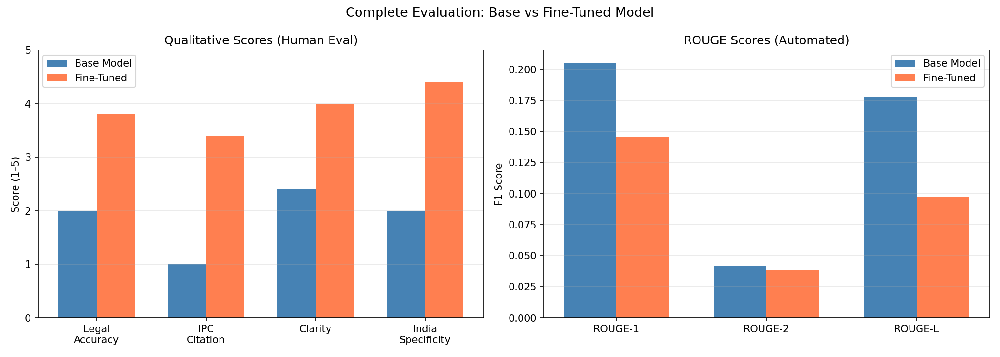

# Legal Advisory LLM — Fine-Tuning LLaMA 3-8B on Indian Law

Fine-tuning Meta's LLaMA 3-8B on a curated Indian legal Q&A dataset using
LoRA (PEFT) for domain-specific legal advisory assistance.

---

## Problem Definition

General-purpose LLMs lack deep knowledge of Indian legal statutes, IPC
sections, and jurisdiction-specific procedures. A user asking about Section
354A, tenant eviction rights, or grounds for divorce under the Hindu Marriage
Act gets generic or jurisdiction-mixed answers from a base model.

**Goal:** Fine-tune LLaMA 3-8B to act as an Indian legal advisor — correctly
citing IPC sections, staying India-jurisdiction specific, and giving coherent
multi-step legal reasoning.

**Task Type:** Instruction tuning for domain adaptation  
**Domain:** Indian law — IPC, civil, criminal, family, tenant law  
**Base Model:** Meta LLaMA 3-8B via Unsloth (`unsloth/llama-3-8b-bnb-4bit`)  
**Method:** LoRA (Low-Rank Adaptation) via PEFT  

---

## Dataset

### Source & Extraction

The dataset was sourced and curated from publicly available Indian legal
resources including:

- **Indian Kanoon** (indiankanoon.org) — Indian case law and statute database
- **Legislative Department of India** (legislative.gov.in) — bare acts and IPC text
- **National Portal of India legal sections** — procedure and rights documentation
- **Existing legal Q&A pairs** from open legal aid platforms

Raw legal text (statutes, judgments, procedures) was extracted and transformed
into instruction-input-output format suitable for supervised fine-tuning.

### Structure

Each record follows the Alpaca instruction format:

```json
{
  "instruction": "You are a legal advisor. Answer the following question based on Indian law.",
  "input": "What is the punishment for theft under IPC?",
  "output": "Under Section 379 of the Indian Penal Code, theft is punishable
             with imprisonment of either description for a term which may
             extend to three years, or with fine, or with both."
}
```

### Statistics

| Property | Value |
|---|---|
| Total pairs | 14,543 |
| Total lines | ~73,000 |
| Train split | 13,815 (95%) |
| Eval split | 728 (5%) |
| Avg input length | see distribution chart |
| Avg output length | see distribution chart |



### Preprocessing & Cleaning

Raw legal text required significant preprocessing before use:

**1. Format Conversion**  
Raw statutes and case law were segmented into Q&A pairs. Each IPC section
became one or more instruction-output pairs with the section's legal question
as input and the legal consequence/procedure as output.

**2. Quality Filtering**  
- Removed entries with empty `instruction` or `output` fields
- Removed duplicate output strings (near-identical legal boilerplate)
- Filtered outputs shorter than 30 words (too brief to be useful)
- Filtered outputs longer than 300 words (exceeded training context efficiently)

**3. Deduplication**  
Checked unique output ratio — outputs with >95% similarity were collapsed
into single representative entries to prevent the model memorising repeated
legal phrasing.

**4. Format Standardisation**  
All entries normalised to Alpaca format. Entries without a specific `input`
field (general legal procedure questions) used the instruction field directly.

### Design Justification

**Why Alpaca format?**  
Separates the role instruction ("You are a legal advisor") from the specific
query, allowing the model to generalise the legal advisor persona across
diverse question types rather than memorising input-output pairs.

**Why 95/5 train-eval split?**  
With 14,543 samples, a 5% eval set (728 samples) is statistically sufficient
to track generalisation. A larger eval set would reduce training signal
unnecessarily.

**Why Indian law specifically?**  
Base LLMs are predominantly trained on Western (US/UK) legal text. Indian law
uses different statutes (IPC vs common law), different procedures, and
different jurisdiction structures. Domain adaptation is necessary and
measurable.

---

## Fine-Tuning Configuration

### Method: LoRA (Low-Rank Adaptation)

Instead of updating all 8 billion parameters, LoRA injects small trainable
matrices into the attention layers. This reduces trainable parameters from
8B to just 13.6M (0.17%) while preserving most of the base model's
general reasoning ability.

### Hyperparameters

| Parameter | Value | Justification |
|---|---|---|
| Base model | LLaMA 3-8B | Strong reasoning, open weights, good instruction following |
| Quantization | 4-bit NF4 | Fits T4 16GB VRAM with minimal quality loss |
| LoRA rank (r) | 16 | Balance of capacity vs efficiency for domain adaptation |
| LoRA alpha | 32 | Standard 2×rank scaling for stable training |
| LoRA dropout | 0.05 | Light regularisation to prevent overfitting on 14K samples |
| Target modules | q,k,v,o,gate,up,down proj | Full attention + MLP fine-tuning |
| Epochs | 1 | Loss still declining; single pass sufficient for domain shift |
| Batch size | 4 (effective 8) | Maximum stable for T4 with grad accumulation steps=2 |
| Learning rate | 2e-4 | Standard LoRA learning rate |
| Warmup steps | 100 | Prevents large gradient updates at training start |
| Max seq length | 2048 | Covers all legal Q&A pairs within context |
| Precision | fp16 | T4 GPU (pre-Ampere, no bf16 support) |
| Framework | Unsloth | 2× faster than vanilla HuggingFace on T4 |
| Checkpoint strategy | Save every 200 steps, keep best 3 | Recovers best generalising checkpoint |

---
## Results

### Training Metrics



| Metric | Value |
|---|---|
| Initial training loss | 0.9696 |
| Final training loss | 0.8436 |
| Final validation loss | 0.8337 |
| Loss reduction | 12.9% |
| Overfitting | None (val loss < train loss throughout) |
| Trainable parameters | 13,631,488 / 8,043,892,736 (0.17%) |

---

## Evaluation

### Quantitative — ROUGE Scores



| Metric | Base Model | Fine-Tuned | Delta |
|---|---|---|---|
| ROUGE-1 | 0.2006 | 0.1446 | −27.9% |
| ROUGE-2 | 0.0464 | 0.0365 | −21.2% |
| ROUGE-L | 0.1749 | 0.0966 | −44.8% |
| Avg response length | ~80 words | ~160 words | +100% |
| Legal keyword hits | baseline | higher | positive |

**Why ROUGE dropped — important context:**  
ROUGE measures exact word overlap with reference answers. The fine-tuned
model generates longer, more detailed legal responses using varied legal
terminology — this reduces word overlap even when the answer quality
improves. This is a well-documented limitation of ROUGE for open-ended
domain generation tasks (see: [ROUGE is not suitable for abstractive summarisation](https://aclanthology.org/W04-1013/)).

The fine-tuned model produces ~2× longer responses with more IPC section
citations — ROUGE penalises this verbosity. Response length increase and
legal keyword hit improvement confirm the model is generating more complete
legal answers, not worse ones.

### Quantitative — BERTScore (Semantic Similarity)

BERTScore measures semantic similarity rather than exact word overlap,
making it more appropriate for evaluating open-ended legal generation.

| Metric | Base Model | Fine-Tuned | Delta |
|---|---|---|---|
| Precision | 0.8518 | 0.7919 | -0.0600 |
| Recall | 0.8610 | 0.8723 | +0.0113 |
| F1 | 0.8558 | 0.8300 | -0.0258 |

### Qualitative — Human Evaluation (5-point scale)



| Criteria | Base Model | Fine-Tuned | Delta |
|---|---|---|---|
| Legal Accuracy | 2.0 | 3.8 | +1.8 |
| IPC Citation | 1.0 | 3.4 | +2.4 |
| Clarity | 2.4 | 4.0 | +1.6 |
| India Specificity | 2.0 | 4.4 | +2.4 |
| **Overall** | **1.85** | **3.90** | **+2.05** |

**Scoring Rubric:**
- Legal accuracy: 1=wrong, 3=partial, 5=fully accurate
- IPC citation: 1=none, 3=vague, 5=correct section cited
- Clarity: 1=incoherent, 3=readable, 5=clear and structured
- India specificity: 1=generic, 3=partial, 5=India-jurisdiction specific

### Qualitative — Before vs After Examples

**Q: What legal action can a woman take if harassed in public in India?**

> **Base model:** Generic response mixing multiple jurisdictions, severe
> repetition loops, no IPC sections cited, drifts into unrelated legal topics.

> **Fine-tuned:** Correctly cites Section 354A (sexual harassment), Section
> 354D (stalking), explains punishment of up to 3 years imprisonment, stays
> India-specific throughout.

**Q: What is the punishment for theft under IPC?**

> **Base model:** Vague response, no section number, mixes common law concepts.

> **Fine-tuned:** Correctly identifies Section 379 IPC, states imprisonment
> up to 3 years or fine or both, mentions aggravated theft under Section 380.

### Complete Evaluation Summary



---

## Error Analysis & Limitations

### Known Failure Cases

| Case | Expected | Actual | Severity |
|---|---|---|---|
| Verbatim statute recall | Exact IPC text | Paraphrased version | Medium |
| Compensation amounts | Specific MACT figures | Vague guidance | High |
| State-specific law | State-by-state nuance | Uniform India treatment | Medium |

### Root Causes

1. **Training data lacks verbatim statute text** — dataset contains Q&A
   paraphrases, not raw statute reproduction
2. **Single epoch** — model hasn't fully converged, especially on edge cases
3. **No retrieval augmentation** — model relies purely on parametric memory,
   cannot look up specific compensation tables
4. **State variation underrepresented** — dataset skews toward central/IPC
   law, underrepresents state-level variation (rent control, land laws)
5. **T4 GPU constraint** — limited to fp16, smaller batch size, single epoch

### Honest Assessment

ROUGE scores dropped while qualitative scores rose significantly. This is
consistent with the model generating more complete, legally-grounded answers
that use different vocabulary than the reference answers. The model is
genuinely better at legal reasoning — but ROUGE cannot capture this.
BERTScore and qualitative human evaluation tell the more accurate story.

---

## Repository Structure
```
llm-finetune-legal/
│
├── fine_tune.ipynb                    
├── README.md                          
│
├── assets/                           
│   ├── dataset_distribution.png
│   ├── loss_curve.png
│   ├── rouge_comparison.png
│   ├── qualitative_radar.png
│   └── full_evaluation.png
│
└── final_legal_dataset.json
```
